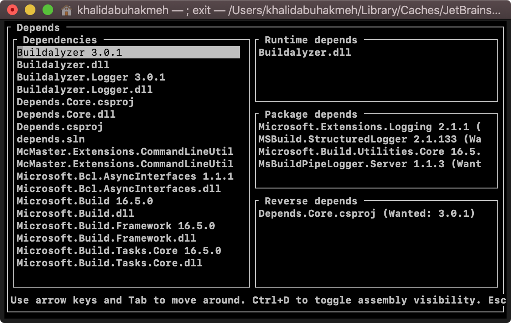

# Depends

 [](https://www.nuget.org/packages/dotnet-depends)


**Depends** is a [dotnet](https://dot.net) global tool that helps developers explore dependencies found in a .NET Core project (`.csproj`, `.vbproj`, `.fsproj`) or solution (`.sln`).



## Getting Started

Developers have the option of installing the .NET tool globally or locally. **We recommend installing it globally using the following command line input.**

### Global Installation

To use Depends system-wide, we can install the tool globally with the following command.

```console
dotnet tool install --global dotnet-depends
```

Once installed, developers can analyze any project from a terminal instance.

```console
dotnet depends ./depends.sln
```

### Local Installation

To install the tool locally, we can run the following commands. **Note, installing local tools only works with .NET Core 3.0 SDK and later**.

In our solution folder, we need to add a new tool manifest.

```console
dotnet new tool-manifest
```

We can then install **Depends** using the following command.

```console
dotnet tool install dotnet-depends
```

To run the tool within a current solution, we need to run the following command.

```console
 dotnet depends ./our-solution.sln
```

## Troubleshooting

[Please refer to the official Microsoft Documentation around .NET tools to resolve any issues.](https://docs.microsoft.com/en-us/dotnet/core/tools/troubleshoot-usage-issues)

## License

MIT License

Copyright (c) 2018 Martin Björkström

Permission is hereby granted, free of charge, to any person obtaining a copy
of this software and associated documentation files (the "Software"), to deal
in the Software without restriction, including without limitation the rights
to use, copy, modify, merge, publish, distribute, sublicense, and/or sell
copies of the Software, and to permit persons to whom the Software is
furnished to do so, subject to the following conditions:

The above copyright notice and this permission notice shall be included in all
copies or substantial portions of the Software.

THE SOFTWARE IS PROVIDED "AS IS", WITHOUT WARRANTY OF ANY KIND, EXPRESS OR
IMPLIED, INCLUDING BUT NOT LIMITED TO THE WARRANTIES OF MERCHANTABILITY,
FITNESS FOR A PARTICULAR PURPOSE AND NONINFRINGEMENT. IN NO EVENT SHALL THE
AUTHORS OR COPYRIGHT HOLDERS BE LIABLE FOR ANY CLAIM, DAMAGES OR OTHER
LIABILITY, WHETHER IN AN ACTION OF CONTRACT, TORT OR OTHERWISE, ARISING FROM,
OUT OF OR IN CONNECTION WITH THE SOFTWARE OR THE USE OR OTHER DEALINGS IN THE
SOFTWARE.
